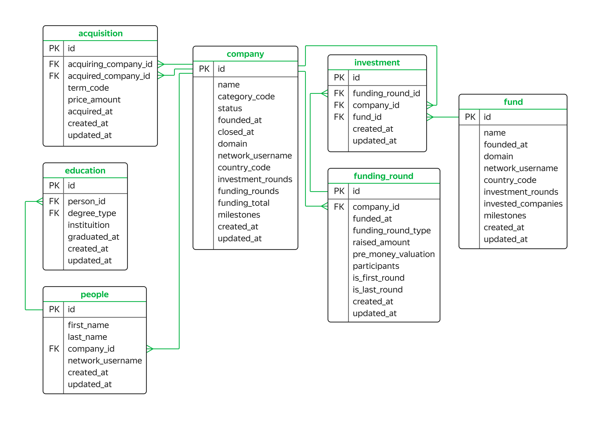

# Venture Capital Investment Database

## Описание проекта

В данном проекте мы работаем с базой данных, которая хранит информацию о венчурных фондах и их инвестициях в компании-стартапы. База данных основана на датасете *Startup Investments*, опубликованном на платформе *Kaggle*. Цель проекта — исследовать рынок венчурных инвестиций, анализируя данные о фондах, компаниях и раундах инвестиций.

### Основные понятия

- **Венчурные фонды:** Финансовые организации, которые инвестируют в стартапы с целью получения высокой прибыли. Венчурные фонды часто инвестируют в компании с инновационными идеями или технологиями, которые находятся на ранних стадиях развития.

- **Раунды финансирования:** Процесс финансирования компании делится на стадии — раунды, которые соответствуют уровню развития компании. Примеры раундов: предпосевной, посевной, ангельский, раунд A, B, C и т.д.

- **Бизнес-ангелы:** Частные инвесторы, которые, помимо финансовой поддержки, предлагают экспертную помощь стартапам.

## Структура базы данных

База данных состоит из следующих таблиц:

### Таблица `acquisition`
Содержит информацию о покупках одних компаний другими.

**Поля:**
- `id` (PK): Уникальный идентификатор покупки.
- `acquiring_company_id` (FK): Идентификатор компании-покупателя.
- `acquired_company_id` (FK): Идентификатор приобретаемой компании.
- `term_code`: Способ оплаты сделки (`cash`, `stock`, `cash_and_stock`).
- `price_amount`: Сумма покупки в долларах.
- `acquired_at`: Дата совершения сделки.
- `created_at`: Дата создания записи.
- `updated_at`: Дата обновления записи.

### Таблица `company`
Содержит информацию о компаниях-стартапах.

**Поля:**
- `id` (PK): Уникальный идентификатор компании.
- `name`: Название компании.
- `category_code`: Категория деятельности компании (например, `news`, `social`).
- `status`: Статус компании (`acquired`, `operating`, `ipo`, `closed`).
- `founded_at`: Дата основания компании.
- `closed_at`: Дата закрытия компании (если она больше не существует).
- `domain`: Домен сайта компании.
- `network_username`: Профиль компании в корпоративной сети.
- `country_code`: Код страны (например, `USA`, `GBR`).
- `investment_rounds`: Количество раундов, в которых компания участвовала как инвестор.
- `funding_rounds`: Количество раундов, в которых компания привлекала инвестиции.
- `funding_total`: Сумма привлечённых инвестиций в долларах.
- `milestones`: Количество важных этапов в истории компании.
- `created_at`: Дата создания записи.
- `updated_at`: Дата обновления записи.

### Таблица `education`
Содержит информацию об уровне образования сотрудников компаний.

**Поля:**
- `id` (PK): Уникальный идентификатор записи об образовании.
- `person_id` (FK): Идентификатор сотрудника (ссылка на таблицу `people`).
- `degree_type`: Учебная степень (например, `BA`, `MS`).
- `institution`: Название учебного заведения.
- `graduated_at`: Дата завершения обучения.
- `created_at`: Дата создания записи.
- `updated_at`: Дата обновления записи.

### Таблица `fund`
Содержит информацию о венчурных фондах.

**Поля:**
- `id` (PK): Уникальный идентификатор фонда.
- `name`: Название фонда.
- `founded_at`: Дата основания фонда.
- `domain`: Домен сайта фонда.
- `network_username`: Профиль фонда в корпоративной сети.
- `country_code`: Код страны фонда.
- `investment_rounds`: Количество инвестиционных раундов, в которых фонд принимал участие.
- `invested_companies`: Количество компаний, в которые фонд инвестировал.
- `milestones`: Количество важных этапов в истории фонда.
- `created_at`: Дата создания записи.
- `updated_at`: Дата обновления записи.

### Таблица `funding_round`
Содержит информацию о раундах инвестиций.

**Поля:**
- `id` (PK): Уникальный идентификатор раунда.
- `company_id` (FK): Идентификатор компании, участвовавшей в раунде.
- `funded_at`: Дата проведения раунда.
- `funding_round_type`: Тип раунда (например, `venture`, `angel`, `series_a`).
- `raised_amount`: Сумма привлечённых инвестиций в долларах.
- `pre_money_valuation`: Оценка стоимости компании до привлечения инвестиций.
- `participants`: Количество участников раунда.
- `is_first_round`: Признак первого раунда для компании.
- `is_last_round`: Признак последнего раунда для компании.
- `created_at`: Дата создания записи.
- `updated_at`: Дата обновления записи.

### Таблица `investment`
Содержит информацию об инвестициях венчурных фондов в компании-стартапы.

**Поля:**
- `id` (PK): Уникальный идентификатор инвестиции.
- `funding_round_id` (FK): Идентификатор раунда (ссылка на таблицу `funding_round`).
- `company_id` (FK): Идентификатор компании-стартапа.
- `fund_id` (FK): Идентификатор фонда.
- `created_at`: Дата создания записи.
- `updated_at`: Дата обновления записи.

### Таблица `people`
Содержит информацию о сотрудниках компаний-стартапов.

**Поля:**
- `id` (PK): Уникальный идентификатор сотрудника.
- `first_name`: Имя сотрудника.
- `last_name`: Фамилия сотрудника.
- `company_id` (FK): Идентификатор компании (ссылка на таблицу `company`).
- `network_username`: Профиль сотрудника в корпоративной сети.
- `created_at`: Дата создания записи.
- `updated_at`: Дата обновления записи.

## ER-диаграмма

  
*(Изображение диаграммы приведено выше)*

## Заключение

На основе базы данных была проанализирована информация о венчурных фондах и инвестициях в компании-стартапы.
## Статус проекта
Завершен
