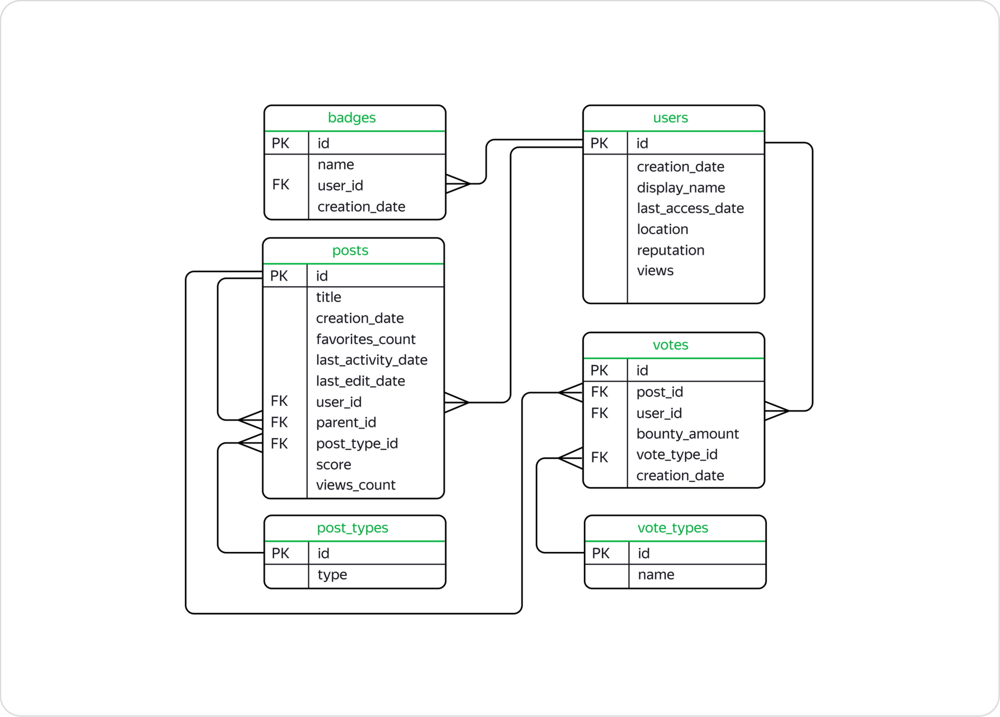

# Анализ данных StackOverflow

## Описание проекта

В данном проекте проводился анализ базы данных **StackOverflow** — популярного сервиса вопросов и ответов о программировании. StackOverflow работает по принципу социальной сети, где пользователи могут задавать вопросы, отвечать на них, оставлять комментарии и оценивать ответы других участников.

Анализ выполнялся на основе версии базы данных, в которой хранится информация о постах, созданных в 2008 году. Однако в таблицах также содержатся данные о более поздних оценках и другой активности пользователей, связанной с этими постами.

## Структура базы данных

Проект использует следующую структуру базы данных:

### 1. Таблица `users`

Содержит информацию о пользователях StackOverflow.

**Основные поля:**

- `id` — уникальный идентификатор пользователя.
- `creation_date` — дата создания профиля пользователя.
- `display_name` — отображаемое имя пользователя.
- `last_access_date` — дата последнего доступа пользователя.
- `location` — местоположение пользователя.
- `reputation` — репутация пользователя.
- `views` — количество просмотров профиля пользователя.

### 2. Таблица `posts`

Содержит информацию о постах, включая вопросы и ответы.

**Основные поля:**

- `id` — уникальный идентификатор поста.
- `title` — заголовок поста (вопроса).
- `creation_date` — дата создания поста.
- `favorites_count` — количество добавлений поста в избранное.
- `last_activity_date` — дата последней активности на посте.
- `last_edit_date` — дата последнего редактирования поста.
- `user_id` — внешний ключ, ссылающийся на таблицу `users`.
- `parent_id` — внешний ключ, ссылающийся на родительский пост (для ответов).
- `post_type_id` — внешний ключ, ссылающийся на таблицу `post_types`.
- `score` — оценка поста (разница между положительными и отрицательными голосами).
- `views_count` — количество просмотров поста.

### 3. Таблица `badges`

Содержит информацию о значках, присуждаемых пользователям за определённые достижения.

**Основные поля:**

- `id` — уникальный идентификатор значка.
- `name` — название значка.
- `user_id` — внешний ключ, ссылающийся на таблицу `users`.
- `creation_date` — дата присуждения значка.

### 4. Таблица `post_types`

Содержит информацию о типах постов.

**Основные поля:**

- `id` — уникальный идентификатор типа поста.
- `type` — тип поста (например, вопрос или ответ).

## 5. Таблица `votes`

Содержит информацию о голосах, отданных за посты.

**Основные поля:**

- `id` — уникальный идентификатор голоса.
- `post_id` — внешний ключ, ссылающийся на таблицу `posts`.
- `user_id` — внешний ключ, ссылающийся на таблицу `users`.
- `bounty_amount` — сумма вознаграждения (если голос связан с вознаграждением).
- `vote_type_id` — внешний ключ, ссылающийся на таблицу `vote_types`.
- `creation_date` — дата, когда был отдан голос.

## 6. Таблица `vote_types`

Содержит информацию о типах голосов.

**Основные поля:**

- `id` — уникальный идентификатор типа голоса.
- `name` — название типа голоса (например, "положительный", "отрицательный").

## ER-диаграмма

  
*(Изображение диаграммы приведено выше)*

## Статус проекта

**Завершен**